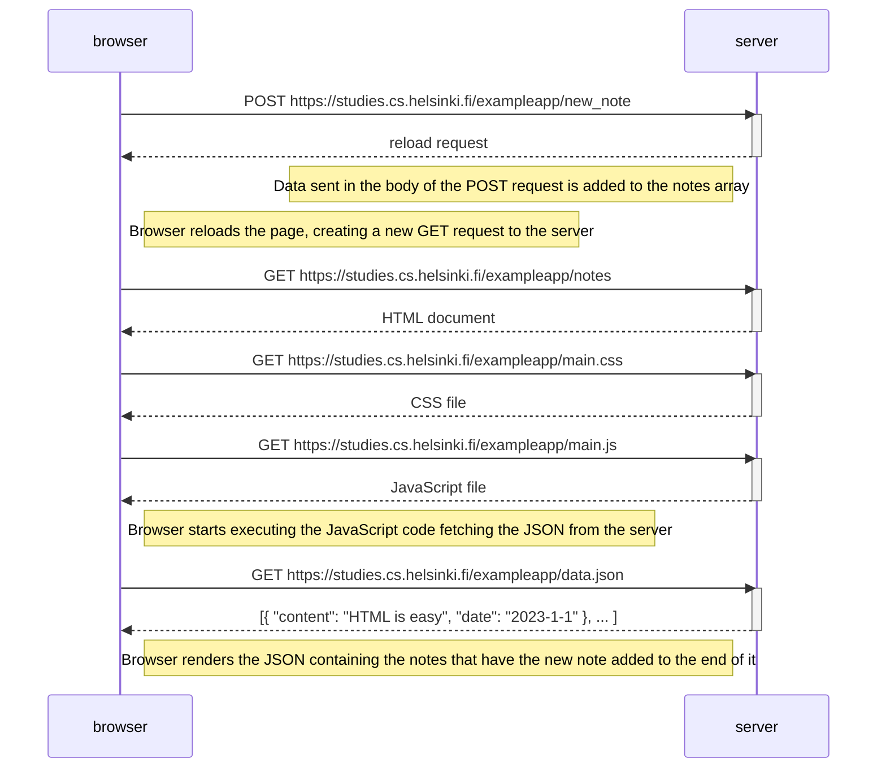

# New note diagram

```mermaid
sequenceDiagram
    participant browser
    participant server

    browser ->> server: POST https://studies.cs.helsinki.fi/exampleapp/new_note
    activate server
    server -->> browser: reload request
    deactivate server

    Note left of server: Data sent in the body of the POST request is added to the notes array

    Note right of browser: Browser reloads the page, creating a new GET request to the server

    browser ->> server: GET https://studies.cs.helsinki.fi/exampleapp/notes
    activate server
    server -->> browser: HTML document
    deactivate server

    browser ->> server: GET https://studies.cs.helsinki.fi/exampleapp/main.css
    activate server
    server -->> browser: CSS file
    deactivate server

    browser ->> server: GET https://studies.cs.helsinki.fi/exampleapp/main.js
    activate server
    server -->> browser: JavaScript file
    deactivate server

    Note right of browser: Browser starts executing the JavaScript code fetching the JSON from the server

    browser->>server: GET https://studies.cs.helsinki.fi/exampleapp/data.json
    activate server
    server-->>browser: [{ "content": "HTML is easy", "date": "2023-1-1" }, ... ]
    deactivate server

    Note right of browser: Browser renders the JSON containing the notes that have the new note added to the end of it
```